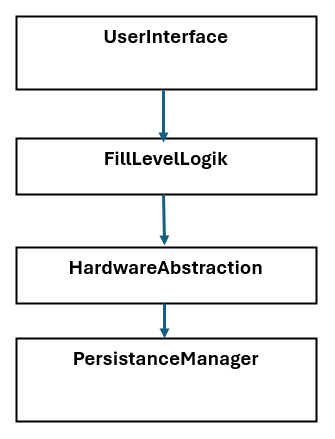

# Architektur

## Software Architektur

### Unterteilung in vier Schichten

- userInterface
- fillLevelLogik
- hardwareAbstraction
- persistanceManager

### Beschreibung

| **Komponente**       | **Rolle**                                             | **Verantwortlichkeiten**
|----------------------|-------------------------------------------------------|---------------------------------------------------------------------------------
| userInterface        | Präsentationsschicht, Darstellung, Barrierefreiheit   | Eindeutige Anzeige, Barrierefreiheit, User-Interaktion, Warnung, Helligkeit
| fillLevelLogik       | Berechnung, Zustände, Fehler                          | Füllstandsberechnung, 90/100%-Grenzen, Fehlerlogik, Echtzeit, User-Interaktionen handeln
| hardwareAbstraction  | Hardware-Interface, Sensorik, Ansteuerung, Robustheit | Zugriff auf Sensoren, Zugriff auf Display/LEDs
| persistanceManager   | Kalibrierung, Speicherung                             | persistente Werte speichern (z.B. Füllstand bvor Gerät abgeschalten wurde), Grenzwerte, Logs, Dimm-Level

### Zuordnung Requirements

| **Komponenten**     | **Requirements**
|---------------------|-----------------------------------------
| userInterface       | 1.3, 2.1, 2.4, 2.5, 2.6, 2.7, 2.9, 4.1, 4.2, 4.3, 5.2, 5.3
| fillLevelLogik      | 1.2, 2.2, 2.8, 3.1, 3.2, 3.3, 5.1, 6.1, 6.2
| hardwareAbstraction | 3.4, 7.1, 1.1
| persistanceManager  | 2.3

## Schnittstellen

| **Ziel**         | **Quelle**       | **Schnittstellen**
|------------------|------------------|---------------------------
| `userInterface`  | `fillLevelLogik` | [fillLevelPercent()](), warning(), 
| `fillLevelLogik` | `userInterface`  | 

### Beschreibung der Schnittstellen

[Schnittstellendokumentation](/docs/SchnittstellenDoc)
